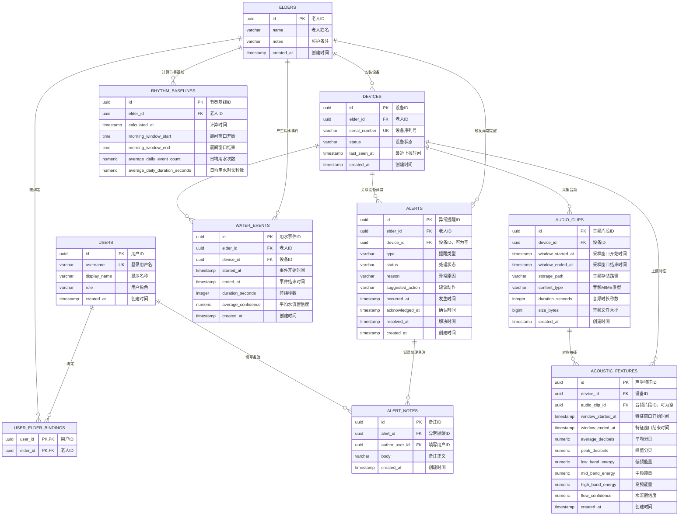

# jiepaiqi 表结构 E-R 图

日期：2026-07-05

## 1. 总体 E-R 图

## 2. 关系说明

- `users` 与 `elders` 是多对多关系，通过 `user_elder_bindings` 限定家属或志愿者能查看哪些老人。
- `elders` 与 `devices` 是一对多关系，一个老人可以绑定多个声感设备。
- `devices` 与 `audio_clips` 是一对多关系，原始音频只保存元数据和存储路径。
- `devices` 与 `acoustic_features` 是一对多关系，声学特征是后端识别用水事件的结构化输入。
- `audio_clips` 与 `acoustic_features` 是一对多关系，但 `acoustic_features.audio_clip_id` 允许为空，用于兼容只上传特征、不上传音频的设备。
- `elders`、`devices` 与 `water_events` 共同描述一次用水事件，事件由连续高置信度声学特征聚合而来。
- `elders` 与 `rhythm_baselines` 是一对多关系，用于保留不同计算时间点的个人节奏基线。
- `elders` 与 `alerts` 是一对多关系，所有异常都必须归属到老人。
- `devices` 与 `alerts` 是可选一对多关系，生活节奏异常可以没有明确设备归因，设备离线异常通常会关联设备。
- `alerts` 与 `alert_notes` 是一对多关系，用于记录确认、联系、上门等人工处理过程。
- `users` 与 `alert_notes` 是一对多关系，用于追踪备注是谁填写的。

## 3. 完整性检查

- 已覆盖身份授权、老人档案、设备、原始音频、声学特征、用水事件、节奏基线、异常提醒和处理备注这 9 类核心业务对象。
- 已满足“保留原始音频用于复盘”的要求：`audio_clips` 保存音频元数据和路径，`acoustic_features.audio_clip_id` 可关联复盘音频。
- 已满足“非侵入式守护”的要求：表结构不包含图像、语音转文字、说话人识别或对话内容字段。
- 建议实现时为所有外键列增加查询索引，尤其是 `elder_id`、`device_id`、`audio_clip_id`、`alert_id` 和 `author_user_id`。
- 建议实现时为时间线查询增加组合索引，例如 `(device_id, window_started_at)`、`(elder_id, started_at)`、`(elder_id, occurred_at)`。
- 建议实现时用枚举或检查约束收敛 `role`、`status`、`type` 等状态字段，避免脏数据进入业务流程。
